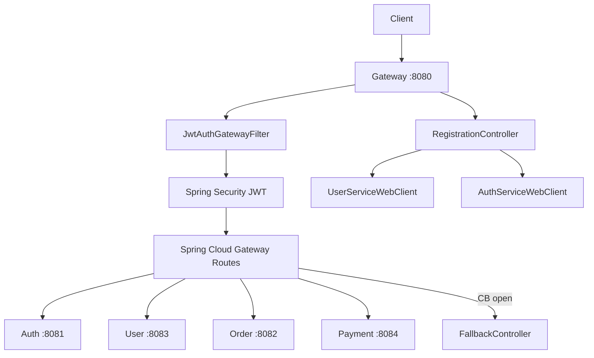

# API Gateway

Единая точка входа (API Gateway) для микросервисной системы. Маршрутизирует REST-запросы к auth, user, order и payment сервисам, проверяет JWT, добавляет trace-заголовки, реализует circuit breaker fallbacks и оркестрирует регистрацию/удаление пользователей.

---

## Содержание

- [Назначение](#назначение)
- [Архитектура](#архитектура)
- [Паттерны](#паттерны)
- [Технологический стек](#технологический-стек)
- [Маршрутизация](#маршрутизация)
- [REST API Gateway](#rest-api-gateway)
- [Безопасность](#безопасность)
- [Circuit Breaker и Fallbacks](#circuit-breaker-и-fallbacks)
- [Трассировка и MDC](#трассировка-и-mdc)
- [Профили и конфигурация](#профили-и-конфигурация)
- [Запуск](#запуск)
- [Тестирование](#тестирование)
- [Структура проекта](#структура-проекта)

---

## Назначение

Gateway выполняет:

1. **Маршрутизация** — проксирование `/auth/**`, `/api/users/**`, `/api/orders/**`, `/api/payments/**`.
2. **JWT Security** — OAuth2 Resource Server (RSA public key) + `JwtAuthGatewayFilter`.
3. **CORS** — конфигурация для frontend (localhost, innowise-project.local).
4. **Circuit Breaker** — Resilience4j + fallback-контроллеры.
5. **Оркестрация** — `POST /register` (user-service + auth-service с rollback), `DELETE /users/internal-delete/{id}`.
6. **Агрегированный health** — `GET /actuators/health` по downstream-сервисам.
7. **Swagger UI** — агрегация OpenAPI всех сервисов.

---

## Архитектура



---

## Паттерны

| Паттерн | Где | Описание |
|---------|-----|----------|
| **API Gateway** | Spring Cloud Gateway | Единая точка входа |
| **Circuit Breaker** | Resilience4j | Изоляция сбоев downstream |
| **Saga / Rollback** | `RegistrationController` | Откат user при ошибке auth |
| **WebClient** | `WebClientConfig` | Reactive HTTP к микросервисам |
| **MDC + Reactor Context** | `MdcUtil`, filters | Сквозная трассировка `X-Trace-Id` |
| **Centralized Errors** | `GlobalAdvice` | Единый формат `ErrorItem` |

---

## Технологический стек

| Категория | Технология |
|-----------|------------|
| Язык | Java 21 |
| Framework | Spring Boot 3.5.4, Spring Cloud 2025.0.0 |
| Gateway | Spring Cloud Gateway (WebFlux) |
| Безопасность | Spring Security OAuth2 Resource Server |
| Resilience | Resilience4j Circuit Breaker |
| Service Discovery | Kubernetes Client (prod) |
| Документация | SpringDoc OpenAPI WebFlux |
| Метрики | Micrometer + Prometheus |
| Тесты | JUnit 5, Mockito, reactor-test |

---

## Маршрутизация

| Route ID | Path | Target |
|----------|------|--------|
| `auth-service` | `/auth/**` | authservice:8081 |
| `user-service` | `/api/users/**`, `/api/cards/**` | userservice:8083 |
| `order-service` | `/api/items/**`, `/api/orders/**`, `/api/order-items/**` | orderservice:8082 |
| `payment-service` | `/api/payments/**` | paymentservice:8084 |
| `*-api-docs` | `/auth/v3/api-docs`, ... | RewritePath → `/v3/api-docs` |

Dev: `spring.cloud.gateway.server.webflux.routes` (localhost).  
Prod: `spring.cloud.gateway.routes` (K8s hostnames, `StripPrefix=0`, HTTP timeouts).

---

## REST API Gateway

Эндпоинты самого Gateway (не прокси):

| Метод | Путь | Описание |
|-------|------|----------|
| `POST` | `/register` | Регистрация: user-service → auth-service |
| `DELETE` | `/users/internal-delete/{id}` | Каскадное удаление user + auth |
| `GET` | `/fallback/{auth,user,order,payment}` | Circuit breaker fallbacks |
| `GET` | `/actuators/health` | Агрегированный health downstream |

**Swagger UI:** [http://localhost:8080/swagger-ui.html](http://localhost:8080/swagger-ui.html)

---

## Безопасность

- **Публичные пути** (`gateway.public-paths`): Swagger, actuator, api-docs — точное совпадение или префикс `path/`.
- **Internal paths** (`gateway.internal-paths`): `/login`, `/register`, `/auth/refresh` — без JWT, с `X-Internal-Call`; сопоставление как у public paths (не `contains`).
- **JWT** — RSA public key из `keys/public.pem`.
- **401/403** — единые `security.CustomAuthenticationEntryPoint` и `CustomAccessDeniedHandler` с JSON-телом и CORS из `cors.*` конфига.
- **JwtAuthGatewayFilter** — при отсутствии Bearer не отдаёт 401 сам, а делегирует в Spring Security (entry point добавляет CORS).

---

## Circuit Breaker и Fallbacks

При недоступности сервиса Gateway перенаправляет на `/fallback/{service}`:

| Fallback | Сообщение |
|----------|-----------|
| `/fallback/auth` | Authentication Service is unavailable... |
| `/fallback/user` | User Service is unavailable... |
| `/fallback/order` | Order Service is unavailable... |
| `/fallback/payment` | Payment Service is unavailable... |

---

## Трассировка и MDC

- Заголовок `X-Trace-Id` — генерируется или пробрасывается.
- `JwtAuthGatewayFilter` и `InternalTraceIdWebFilter` — MDC + Reactor context.
- `WebClientConfig` — исходящие запросы с `X-Internal-Call`, `X-Source-Service`, trace ID.

---

## Профили и конфигурация

| Профиль | Файлы | Назначение |
|---------|-------|------------|
| default | `application.yaml` | Общие: CORS, gateway paths, springdoc, logging |
| `dev` | `application-dev.yaml` | Localhost routes, service discovery |
| `prod` | `application-prod.yaml` | K8s hostnames, timeouts, `server.address` |
| `test` | `application-test.yml` | Dummy URLs для тестов |

---

## Запуск

```bash
# Локально
mvn spring-boot:run -Dspring-boot.run.profiles=dev

# Docker (prod)
docker build -t gateway .
docker run -p 8080:8080 gateway
```

---

## Тестирование

```bash
mvn test
```

### Структура тестов

```
src/test/java/com/mymicroservice/gateway/
├── unit/
│   ├── controller/
│   ├── filter/
│   ├── webclient/
│   ├── util/
│   ├── advice/
│   ├── security/
│   ├── config/
│   └── dto/
├── integration/
│   ├── config/
│   └── GatewayApplicationTests.java
├── configuration/
│   └── TestSecurityConfig.java
└── util/
    ├── data/TestConstants.java
    └── *Generator.java
```

### Стиль именования

```
<имяМетода>_Should<Ожидание>_When<Условие>
```

Примеры:
- `register_ShouldReturnOk_WhenBothServicesSucceed`
- `filter_ShouldForwardRequest_WhenJwtIsMissing`
- `filter_ShouldNotTreatPathAsInternal_WhenPathOnlyContainsLoginSubstring`
- `getPublicPaths_ShouldContainExpectedPaths_WhenTestProfileIsActive`

---

## Структура проекта

```
gateway/
├── src/main/java/.../gateway/
│   ├── config/           # Security, CORS, WebClient, OpenAPI
│   ├── filter/           # JwtAuthGatewayFilter, InternalTraceIdWebFilter
│   ├── security/         # CustomAuthenticationEntryPoint, CustomAccessDeniedHandler
│   ├── controller/       # Registration, UserDeletion, Fallback, Actuator
│   ├── webclient/        # AuthServiceWebClient, UserServiceWebClient
│   └── util/             # MdcUtil, ResponseUtil, ErrorItem, CorsHeadersWriter
├── src/main/resources/
│   ├── application.yaml
│   ├── application-dev.yaml
│   ├── application-prod.yaml
│   └── keys/public.pem
└── src/test/java/.../gateway/
    ├── unit/
    ├── integration/
    └── util/
```

---

## Лицензия

Учебный / демонстрационный проект @juliakaiko.
